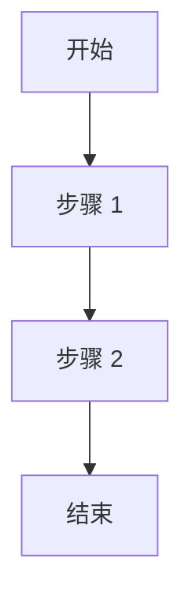

Learning how to write basic Chripy syntax and Markdown syntax.

More information about Chripy syntax can be found [here](https://chirpy.cotes.page/posts/write-a-new-post/) and [here](https://chirpy.cotes.page/posts/text-and-typography/).

{: w="200" h="200" }
_Image Caption_

{: w="200" h="200" .left }
<!-- _Image Caption_ -->
{: w="200" h="200" .right }
<!-- _Image Caption_ -->

所以我可以在这里疯狂输出所以我可以在这里疯狂输出所以我可以在这里疯狂输出所以我可以在这里疯狂输出所以我可以在这里疯狂输出所以我可以在这里疯狂输出所以我可以在这里疯狂输出所以我可以在这里疯狂输出所以我可以在这里疯狂输出所以我可以在这里疯狂输出所以我可以在这里疯狂输出所以我可以在这里疯狂输出所以我可以在这里疯狂输出所以我可以在这里疯狂输出所以我可以在这里疯狂输出所以我可以在这里疯狂输出所以我可以在这里疯狂输出所以我可以在这里疯狂输出所以我可以在这里疯狂输出所以我可以在这里疯狂输出啊


  


> Example line for prompt.
{: .prompt-info }  

`inline code part`

`/path/to/a/file.extend`{: .filepath}

```
This is a plaintext code snippet.
```

```yaml
key: value
```

```shell
echo 'No more line numbers!'
```
当你想隐藏代码块的行号时，可以为其添加nolineno类：
```shell
echo 'No more line numbers!'
```
{: .nolineno }

```shell
# content
```
{: file="path/to/file" }


```liquid

  This product's title contains the word Pack.

```


